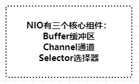

# NIO非阻塞网络编程三大核心理念
## JAVA NIO
始于Java1.4，提供了新的Java IO操作非阻塞API.
用意是替代Java IO和Java Networking相关的API.

## Buffer缓冲区
缓冲区本质是一个可以写入数据的内存块(类似数组)，然后可以再次读取。此内存块包含在NIO Buffer对象中，该对象提供了一组方法，可以更轻松地使用内存块。
相比较直接对数组的操作，Buffer API更加容易操作和管理

使用Buffer进行数据写入与读取，需要进行如下四个步骤：
1. 将数据写入缓存区
2. 调用buffer.flip()，转换为读取模式
3. 缓冲区读取数据
4. 调用buffer.clear()或buffer.compact()清除缓冲区

### Buffer工作原理
Buffer三个重要属性：
capacity容量：作为一个内存块，Buffer具有一定的固定大小，也称为“容量”。
position位置：写入模式时代表写数据的位置。读取模式时代表读取数据的位置。
limit限制：写入模式，限制等于buffer的容量。读取模式下，limit等于写入的数据量。

### ByteBuffer内存类型
ByteBuffer为性能关键型代码提供了直接内存(direct堆外)和非直接内存(heap堆)两种实现。
堆外内存获取的方式：ByteBuffer directByteBuffer = ByteBuffer.allocateDirect(noBytes);

#### 好处：
1、进行网络IO或者文件IO时比heapBuffer少一次拷贝。(file/socket --- OS memory --- jvm heap)GC会移动对象内存，在写file或socket的过程中，JVM的实现中，会先把数据复制到堆外，再进行写入。
2、GC范围之外，降低GC压力，但实现了自动管理。DirectByteBuffer中有一个Cleaner对象(PhantomReference)，Cleaner被GC前会执行clean方法，触发DirectByteBuffer中定义的Deallocator
#### 建议
1、性能确实可观的时候才去使用；分配给大型、长寿命；(网络传输、文件读写场景)
2、通过虚拟机参数MaxDirectMemorySize限制大小，防止耗尽整个机器的内存；

## Channel通道

### SocketChannel
SocketChannel用于建立TCP网络连接，类似java.net.Socket。有两种创建socketChannel形式：
1、客户端主动发起和服务器的连接。
2、服务端获取的新连接。
write写：write()在尚未写入任何内容时就可能返回了。需要在循环中调用write()。
read读：read()方法可能直接返回而根本不读取任何数据，根据返回的int值判断读取了多少字节。
### ServerSocketChannel
ServerSocketChannel可以监听新建的TCP连接通道，类似ServerSocket。
serverSocketChannel.accept()：如果该通道处于非阻塞模式，那么如果没有挂起的连接，该方法将立即返回null。必须检查返回的SocketChannel是否为null。

这种低效的循环检查，会是NIO服务端的正确开发方式嘛？
## Selector选择器
Selector是一个Java NIO组件，可以检查一个或多个NIO通道，并确定哪些通道已准备好进行读取或写入。实现单个线程可以管理多个通道，从而管理多个网络连接。
一个线程使用Selector监听多个channel的不同事件：
四个事件分别对应SelectionKey四个常量。
1、Connect连接(SelectionKey.OP_CONNECT)
2、Accept准备就绪(OP_ACCEPT)
3、Read读取(OP_READ)
4、Write写入(OP_WRITE)

实现一个线程处理多个通道的核心概念理解：事件驱动机制。
非阻塞的网络通道下，开发者通过Selector注册对于通道感兴趣的事件类型，线程通过监听事件来触发相应的代码执行。(拓展：更底层是操作系统的多路复用机制)

## NIO对比BIO
如果你的程序需要支持大量的连接，使用NIO是最好的方式。
Tomcat8中，已经完全去除BIO相关的网络处理代码，默认采用NIO进行网络处理。

## NIO与多线程结合的改进方案

## 小结
NIO为开发者提供了功能丰富及强大的IO处理API，但是在应用于网络应用开发的过程中，直接使用JDK提供的API，比较繁琐。而且要想将性能进行提升，光有NIO还不够，还需要将多线程技术与之结合起来。

因为网络编程本身的复杂性，以及JDK API开发的使用难度较高，所以在开源社区中，涌出来很多对JDK NIO进行封装、增强后网络编程框架，例如：Netty、Mina等。

