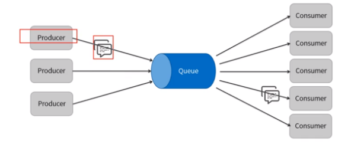
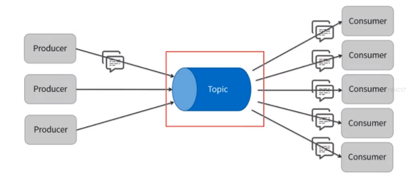
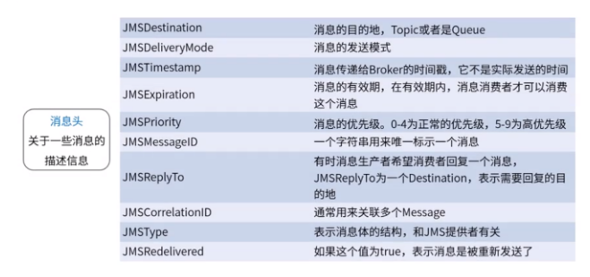
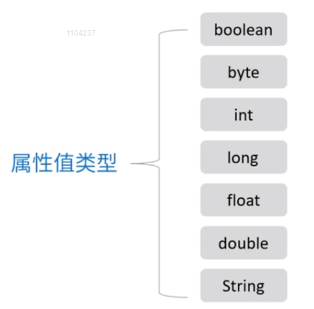

# ActiveMQ入门
## 课程目录
* ActiveMQ是什么
* JMS规范
* ActiveMQ的特性
* ActiveMQ如何安装
* ActiveMQ如何使用

## ActiveMQ是什么
ActiveMQ是Apache出品，最流行的，能力强劲的开源消息总线。
ActiveMQ是一个完全支持JMS1.1和J2EE1.4规范的JMS Provider实现，尽管JMS规范出台已经是很久的事情了，但是JMS在当今的J2EE应用中间仍然扮演着特殊的地位。

## JMS是什么
Java消息服务(Java Message Service,即JMS)应用程序接口是一个Java平台中关于面向消息中间件(MOM)的API,用于在两个应用程序之间，或分布式系统中发送消息，进行异步通信。Java消息服务是一个与具体平台无关的API。

## JMS的对象模型
| ConnectionFactory |         连接工厂          |
| ----------------- | ------------------------ |
| Connection        | 连接                      |
| Session           | 会话                      |
| Destination       | 目的                      |
| MessageProducer   | 生产者                    |
| MessageConsumer   | 消费者                    |
| Message           | 消息                      |
| Broker            | 消息中间件的实例(ActiveMQ) |

## JMS的消息模型
### Point-to-Point(P2P)/点对点


### Publish/Subscribe(Pub/Sub)/主题(发布订阅)


## JMS的消息结构




消息属性可以理解为消息的附加消息头，属性名可以自定义



## ActiveMQ的特性
> 支持多种编程语言
> 支持多种传输协议
> 有多种持久化方式

## 安装ActiveMQ
### 环境准备
> CentOS7
> JDK1.8
### 下载ActiveMQ
进入/tmp目录
``` bash
cd /tmp
```

使用wget下载存档
``` bash
wget -c  下载地址
```

提取存档
``` bash
tar -zxvf 文件包 -C /var
```

修改ActiveMQ的目录名
``` bash
mv /var/文件包/   /var/activemq/
```

### 启动ActiveMQ
以后台进程启动成功会有以下输出
```
INFO: Loading '/var/activemq//bin/env'
INFO: Using java '/usr/local/developer/jdk1.8.0_211/bin/java'
INFO: Starting - inspect logfiles specified in logging.properties and log4j.properties to get details
INFO: pidfile created : '/var/activemq//data/activemq.pid' (pid '8512')
```

作为后台进程启动ActiveMQ
```
./bin/activemq start
```

停止ActiveMQ
```
./bin/activemq stop
```

## ActiveMQ服务
前面使用命令运行ActiveMQ,但最好的方式是将ActiveMQ作为服务启动，使用system服务将可以确保ActiveMQ能在系统启动时自动启动。

### 创建ActiveMQ服务
1、使用vim创建一个systemd服务文件
```
vi /usr/lib/systemd/system/activemq.service
```
2、填入以下内容
```
[Unit]
Description=ActiveMQ service
After=network.target

[Service]
Type=forking
ExecStart=/var/activemq/bin/activemq start
ExecStop=/var/activemq/bin/activemq stop
User=root
Group=root
Restart=always
RestartSec=9
StandardOutput=syslog
StandardError=syslog
SyslogIdentifier=activemq

[Install]
WantedBy=multi-user.target
```

3、修改/var/activemq/bin/env配置，在配置文件中修改如下
```
# Location of the java installation
# Specify the location of your java installation using JAVA_HOME, or specify the
# path to the "java" binary using JAVACMD
# (set JAVACMD to "auto" for automatic detection)
JAVA_HOME="/usr/local/java/jdk1.8.0_181"
JAVACMD="auto"
```

### ActiveMQ服务操作
启动ActiveMQ服务
```
systemctl start activemq
```

查看服务状态
```
systemctl status activemq
```

设置开机自动启动
```
ln -s /usr/lib/systemd/system/activemq.service /etc/systemd/system/multi-user.target.wants/activemq.service
systemctl enable activemq
```

#### 防火墙添加ActiveMQ的端口
ActiveMQ启动后，外部还无法访问，还需要在防火墙配置中增加ActiveMQ的Web管理端口和通讯端口。

添加端口
```
Web管理端口默认为8161（admin/admin），通讯端口默认为61616
firewall-cmd --zone=public --add-port=8161/tcp --permanent
firewall-cmd --zone=public --add-port=61616/tcp --permanent
```

重启防火墙
```
systemctl restart firewalld.service
```

### 使用ActiveMQ
#### 使用ActiveMQ的Web管理平台
ActiveMQ自带有管理平台，在浏览器访问http://服务ip:8161/admin即可进入
ActiveMQ的管理页面默认开启了身份校验
账号：admin
密码：admin


#### Web管理配置
ActiveMQ的Web管理平台是基于
